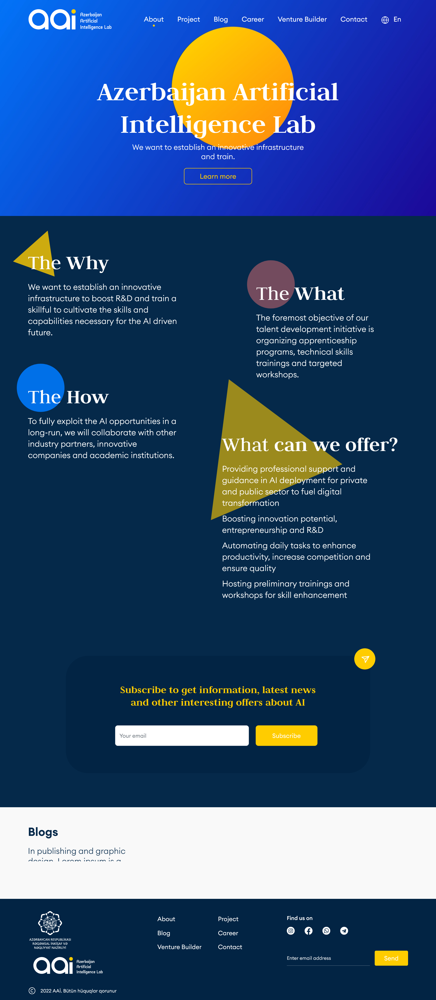

# AILab Concept Website

## Overview
This project is a concept website for AILab.az, an Azerbaijani AI lab. The website was developed as part of an internship program application for a Front-end Engineer position, focusing on Next.js, React, JavaScript and Tailwind CSS. The site has been built using the Next.js stack and deployed via Vercel.

## Gallery

Concept design:


Current website design:




## Key Features
- **Modern Design**: Reflects the cutting-edge nature of AI technology.
- **Responsive Layout**: Ensures a seamless user experience across all devices.
- **High Performance**: Optimized for fast loading times and smooth interactions.

## Technologies Used
- **Next.js**: For server-side rendering and routing.
- **React**: For building interactive UI components.
- **JavaScript**: For dynamic functionality.
- **Tailwind CSS**: For styling and layout.

## Deployment
The website is deployed on Vercel, providing a reliable and scalable hosting environment. You can view the live site [here](https://ailab-roan.vercel.app/).

## How to Run Locally
1. Clone the repository:
   ```bash
   git clone https://github.com/optim00s/ailab.git
   ```
2. Navigate to the project directory:
   ```bash
   cd ailab
   ```
3. Install dependencies:
   ```bash
   npm install
   ```
4. Start the development server:
   ```bash
   npm run dev
   ```

## Contribution
As this project is part of my portfolio, contributions are not currently accepted. However, feedback and suggestions are always welcome!


